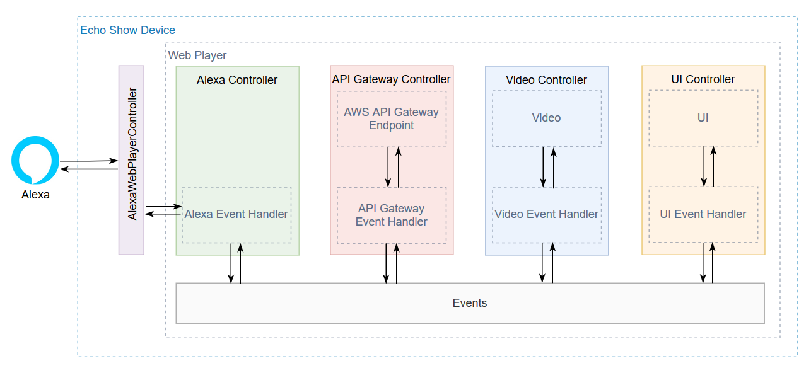

# Web Player

## Introduction
This project contains reference software for building an Alexa video skill web player targeting Echo Show devices.

A web player acts as the front end of the video skill.

Below is a high level diagram of the web player structure.   

## Description of the Web Player Components

**Alexa**

The Alexa AI running in the cloud.

**Multimodal device** 

This is the customer device (Echo Show) that runs the skill.

**Alexa Web Player Controller**

An Amazon Alexa library that the web player depends on. The library can facilitate communication between the web player and the device.

**Web Player**

The front end of a skill that runs on device. It plays the video, renders the transport controls, and so on.

**Alexa Controller**

This component handles events to and from Alexa itself. For example, Alexa sends a play video request (`LOAD_CONTENT` event).

**API Gateway Controller**

This component handles events relating to the web player calling AWS API Gateway.  The API Gateway is used as a secure https endpoint that the web player can call to perform actioning including:
* Send video progress updates to the lambda to support 'continue watching' functionality
* Log web player logs from the device to cloud watch logs during development
* Query the lambda for the next or previous episode when watching episodic content    

**Video Controller**

This component manages playing the actual video and related video events, such as:
* video time updates
* video ended event

**UI Controller**

This component manages rendering the UI transport controls as well as handling touch screen events, such as the user touches the play button.

**Events**

The web player is built on a publish/subscribe model. Every controller can listen to, or handle web player events that originate from any other controller.

## Requirements
 
* [Node.js 10.x](https://nodejs.org/en/download/)

  Currently, this is the only supported version. Test your installed version with this command: `node --version`
* npm (prebuilt in Node.js)

  Currently, Node.js supports every npm version between 5.6.0 and 6.11.3. Test your npm version with: `npm --version`. Use `npm install -g npm@version` to downgrade your npm, if needed.
  
* [Python 2.7 or later](https://www.python.org/downloads/) (required by some installation packages)
* [Firefox](https://www.mozilla.org/firefox/new/)
* PowerShell (Windows) or terminal (macOS)

### Other Dependencies

Check your environment against the settings listed [here](https://github.com/nodejs/node-gyp).

**Windows users:** Through an elevated PowerShell or CMD.exe (run as Administrator),  you must install all the required tools and configurations using Microsoft windows-build-tools with this command:

`npm install --global --production windows-build-tools`

**macOS users:** You might need to install Xcode and the Xcode Command Line Tools by running `xcode-select --install` on a terminal.

## Installation

1. cd to `<project-root>/web-player`
2. Run `npm run release`

   This performs the following:
      
      * installs dependencies
      * cleans the project
      * runs unit tests
      * compiles the code

The output is written to `./dist` with the following contents:        
  * `./dist/bin/web-player` The built web-player files
  * `./doc/index.html` Autogenerated documentation of the code
  * `./coverage/index.html` An HTML code coverage report

## Usage
This web player is an important component of a multimodal video skill.

It needs to be configured in the skill manifest. You can do that in the [developer portal](https://developer.amazon.com/alexa/console/ask), however the infrastructure CLI tool handles this for you.

It also needs to be hosted on the internet. The infrastructure CLI tool automatically hosts the web player on S3. If you want to manually host the web player on S3 instead, ensure that the web player S3 objects are publicly readable.

## Features
Here is an outline of the web player's features.

### Supported
The web player supports the following:

**UI (touch)**

* play
* pause
* seek forward/backward
* seek bar
* closed captioning
* next episode

**Voice**

* play
* pause
* seek forward/backward, for example *"Alexa fast forward 1 minute"*
* next/previous episode      

### Not Supported
The web player, currently, does not support the following:

**UI (touch)**

* previous episode

**Voice**

* closed captioning
            
## Development

The following steps assume that you already have a video skill for Echo Show devices up and running, and that you want to update the web player.

**With the infrastructure CLI tool**

1. Use the cli tool's `--update --web-player` option
2. Invoke your skill and observe changes
    1. Note, it may take up to 5 minutes for your web player changes to be reflected on device.  If you do not want to wait that long you can restart the device. 

**Without the infrastructure CLI tool**
 1. Build the project with `npm run release`
    
    If you want a faster build that skips unit tests, run `npm run compile`.
 2. Manually upload the web player to S3 (located in `./dist/web-player/`).  
 3. Ensure the S3 objects are publicly readable.
 4. Invoke your skill and observe changes.
    
## Documentation
* [Web Player](https://developer.amazon.com/docs/video-skills-multimodal-devices/build-web-player.html) 

## License

This library is licensed under the Amazon Software License.
